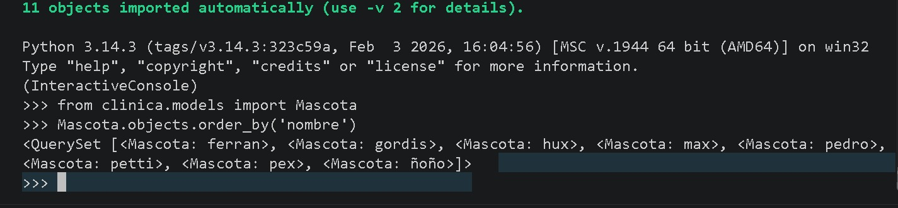
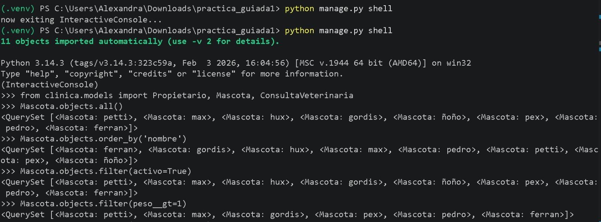
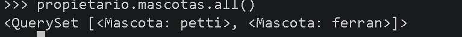
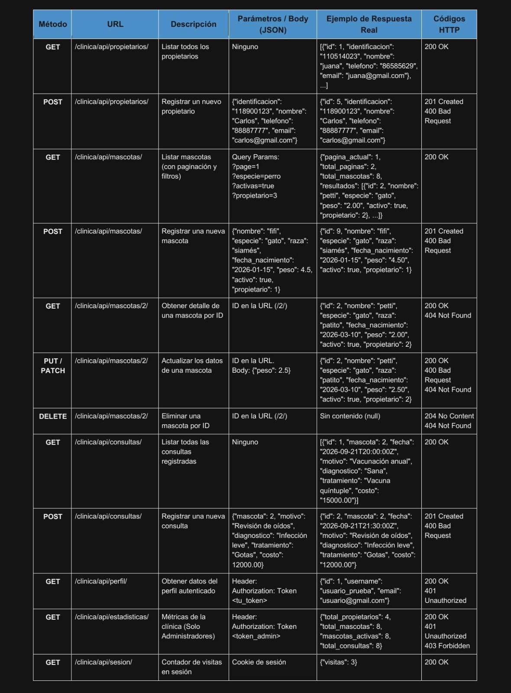
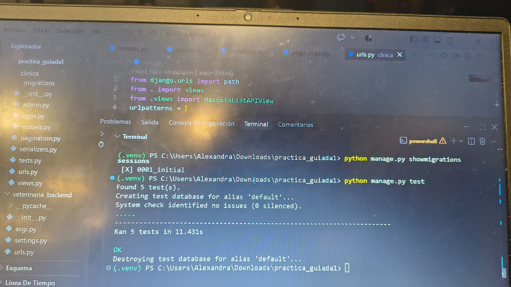

# Sistema de Gestión Veterinaria

Proyecto realizado en Django para llevar el registro de propietarios, mascotas y consultas veterinarias.

## Requisitos

- Python
- Django
- Django REST Framework

## Instalación

Crear el entorno virtual:

python -m venv .venv

Activar el entorno virtual:

.venv\Scripts\activate

Instalar Django:

python -m pip install "Django>=5.2,<5.3"

Instalar Django REST Framework:

pip install djangorestframework

## Migraciones

Para crear y aplicar las migraciones:

python manage.py makemigrations
python manage.py migrate

## Ejecutar el proyecto

Para iniciar el servidor:

python manage.py runserver

## Pruebas

Para ejecutar las pruebas:

python manage.py test

## Funcionalidades

El sistema permite registrar propietarios, mascotas y consultas veterinarias.

También cuenta con filtros, paginación, autenticación y permisos para controlar el acceso a algunos endpoints.

## reflexion 
Cuando Postman manda el POST a la URL, esta lo pasa a la View. La vista recibe los datos y los envía al Serializer para hacer la validación. Si todo está bien, el Serializer usa el Model a través del ORM para guardar la información en la base de datos. Por último, la vista devuelve una Response en JSON confirmando que la consulta se registró con éxito.

